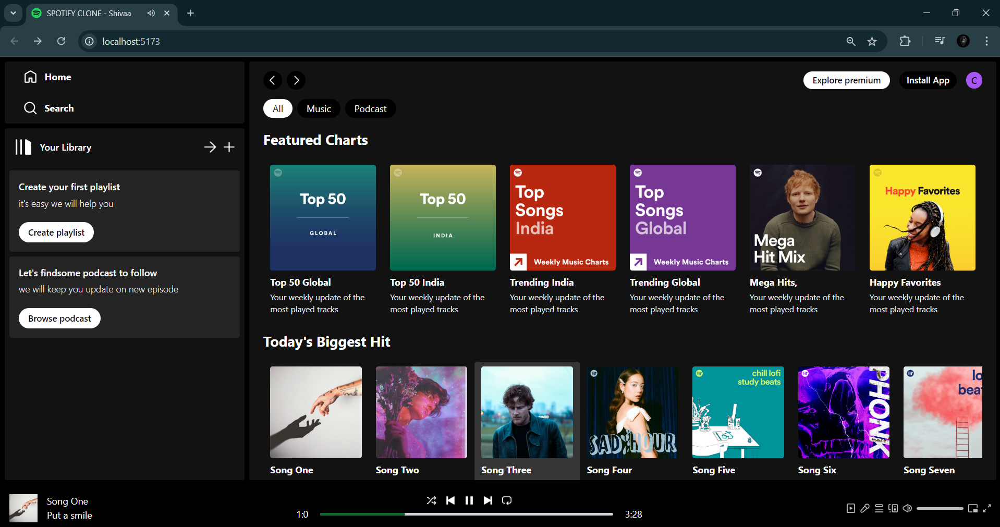
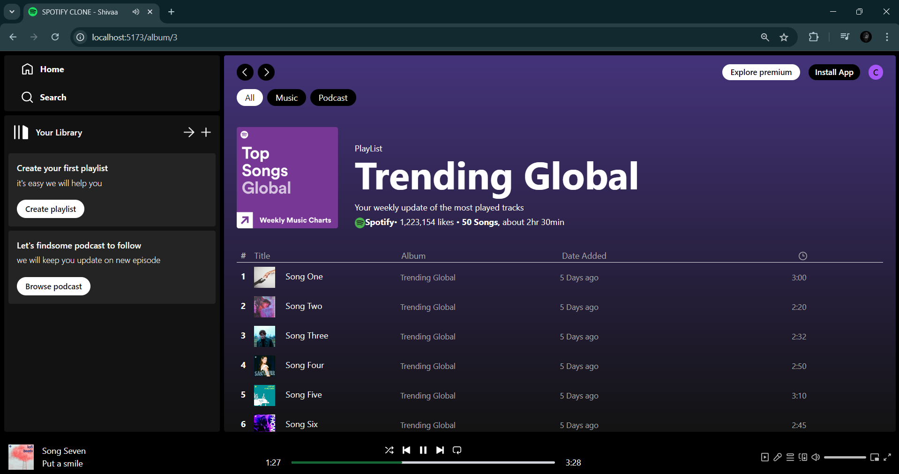

# Spotify Clone

[](https://nodejs.org/)
[](https://vitejs.dev/)
[](https://opensource.org/licenses/MIT)

A Spotify clone built with Vite + React.js, featuring Tailwind CSS for styling. This project replicates the core features of Spotify, including authentication (optional), music player functionality, and browsing playlists, albums, and tracks.

## Table of Contents

- [Features](#features)
- [Technologies Used](#technologies-used)
- [Setup](#setup)
- [Usage](#usage)
- [Screenshots](#screenshots)
- [Project Structure](#project-structure)
- [Contributing](#contributing)
- [License](#license)

## Features

- **Responsive Design**: Fully responsive application optimized for all devices using Tailwind CSS.
- **Music Playback**: Play, pause, skip, and shuffle tracks.
- **Browse Playlists/Albums**: Display and interact with playlists and albums.
- **Track Details**: Show track details including artist, album, and duration.

## Technologies Used

- **Frontend**: Vite, React.js, React Router
- **Styling**: Tailwind CSS

## Setup

1. **Clone the repository**

    ```bash
    git clone https://github.com/your-username/spotify_clone.git
    cd spotify_clone
    ```

2. **Install dependencies**

    ```bash
    npm install
    ```

3. **Run the application**

    ```bash
    npm run dev
    ```

## Usage
- **Home Page**: Browse playlists, albums, and tracks.
- **Player**: Play and control music playback (pause, skip, etc.) from the player interface.

## Screenshots

### Home Page:


### Playlist Page:



## Project Structure

```plaintext
spotify-clone/
├── public/
│   ├── vite.svg             
├── src/
│   ├── assets/              
│   ├── components/          
│   │   ├── AlbumItem.jsx     
│   │   ├── Display.jsx        
│   │   ├── DisplayAlbum.jsx  
│   │   ├── DisplayHome.jsx    
│   │   ├── Navbar.jsx         
│   │   ├── Player.jsx         
│   │   ├── Sidebar.jsx        
│   │   └── SongItem.jsx       
│   ├── context/               
│   │   └── PlayerContext.jsx   
│   ├── App.jsx                
│   ├── index.css             
│   ├── main.jsx               
├── index.html                 
├── .gitignore                 
├── eslint.config.js           
├── package-lock.json          
├── package.json               
├── postcss.config.js          
├── README.md                  
├── tailwind.config.js         
└── vite.config.js            
```

## Contributing
Contributions are welcome! Please create an issue or submit a pull request for any enhancements or bug fixes.

## License
This project is licensed under the MIT License - see the LICENSE file for details.

